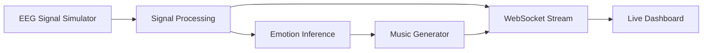
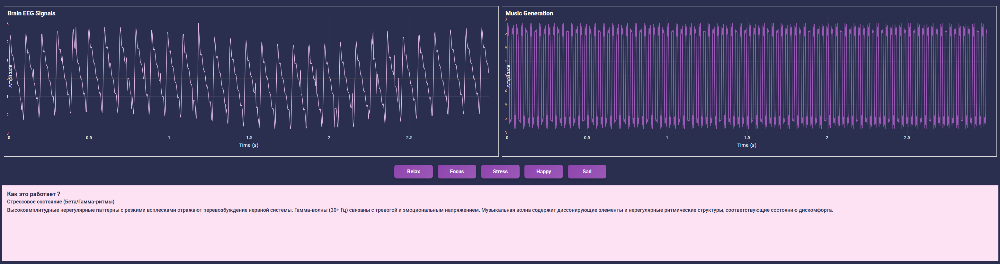

# NeuroMusic Lab — Real-Time EEG-Driven Music Generation System

**NeuroMusic Lab** is a backend-centric, real-time system that simulates EEG signals, derives emotional states, and transforms continuous signal streams into adaptive music.

The project is designed as an **event-driven data pipeline**, where each stage is deterministic, explainable, and isolated.
UI and visualization are secondary — the core value lies in **signal processing, orchestration, and system design**.

---

## What This Project Is About

This is **not** a “neural network that plays music”.

This project demonstrates how:
- continuous signals can be processed in real time
- emotional states can be inferred from signal patterns
- generative systems can be driven by deterministic data pipelines
- backend logic orchestrates analytics, state, and rendering
- optional external dependencies do not break the core flow

The same architectural approach can be applied to:
- biofeedback systems
- IoT telemetry pipelines
- financial signal analysis
- real-time monitoring dashboards

---

## Key Highlights

- Real-time EEG signal simulation
- Deterministic signal processing pipeline
- Emotion inference from frequency patterns
- Adaptive music generation driven by system state
- Live analytics via WebSockets
- Backend-first architecture (Django + Channels)
- Audio rendering treated as an optional dependency
- Fully explainable transformations (no black-box ML)

---

## Technology Stack

### Backend & Core
- **Python** — core application logic
- **Django** — backend framework and request orchestration
- **Django Channels** — WebSocket-based real-time communication
- **ASGI** — asynchronous server interface

### Real-Time & Streaming
- **WebSockets** — live signal and music streaming
- **Event-driven architecture** — continuous state updates

### Signal Processing & Data
- **NumPy** — numerical computations and signal processing
- **SciPy** — frequency analysis and signal transformations
- **Custom EEG simulation** — deterministic signal generation

### Music Generation
- **music21** — algorithmic music composition
- **MIDI** — intermediate musical representation
- **FluidSynth** (optional) — real-time audio synthesis via SoundFont

### Visualization & UI
- **Plotly** — real-time analytical charts
- **Three.js** — interactive 3D brain visualization
- **HTML / CSS / JavaScript** — dashboard UI

### Infrastructure & Tooling
- **Web Audio API** — client-side audio processing
- **PyTorch** — experimental model integration (optional)
- **TensorFlow.js** — client-side signal interpretation (optional)
- **Blender** — 3D model creation and animation
- **Pytest** — automated testing

---

## High-Level Architecture



**Design principle:**  
Unidirectional data flow. Each stage is replaceable and independently testable.

---

## Real-Time Processing Pipeline

1. EEG signal is generated continuously
2. Signal is normalized and analyzed in frequency domain
3. Emotional state is inferred from signal characteristics
4. Music parameters are derived from the current state
5. Musical structure is generated deterministically
6. Signals and music data are streamed to the UI in real time

---

## Live Signal & Music Visualization

<p align="center">
  
</p>

**Left:** simulated EEG signal (time domain)  
**Right:** generated music waveform derived from the same signal state

Both streams are updated live via WebSocket connections.

---

## Emotion Model (Explainable by Design)

The system uses a rule-based emotional model derived from signal characteristics:

| Signal Pattern                  | Interpreted State |
|--------------------------------|-------------------|
| Alpha dominance (8–12 Hz)       | Relaxation        |
| Beta activity (13–30 Hz)        | Focus             |
| Gamma bursts (>30 Hz)           | Stress            |
| Alpha + Beta balance            | Positive mood     |
| Theta dominance (4–7 Hz)        | Sadness / Fatigue |

This approach ensures:
- deterministic behavior
- transparency and explainability
- easy replacement with ML models if required

---

## Audio Generation (Optional)

Audio rendering is treated as an **optional backend dependency**.

- MIDI generation is always available
- WAV rendering uses FluidSynth (optional)
- Audio failures do not affect core pipeline execution

This mirrors production-grade systems where external tools must not break critical data flows.

---

## Project Structure

```
simulator/
  eeg_simulator.py      # EEG signal generation
  analytics.py          # Signal processing & feature extraction
  music_generator.py    # Music synthesis logic
  consumers.py          # WebSocket streaming
  views.py              # HTTP orchestration
templates/
  simulator UI templates
```

---

## What This Project Demonstrates

- Real-time data pipelines
- Deterministic signal processing
- Explainable emotion inference
- Backend-driven real-time visualization
- Isolation of optional dependencies
- System-oriented thinking over demo-driven design

---

## Final Notes

NeuroMusic Lab is intentionally designed as a **system design case**, not a UI showcase.

The focus is on correctness, explainability, and architectural clarity — principles that directly translate to production backend systems.
